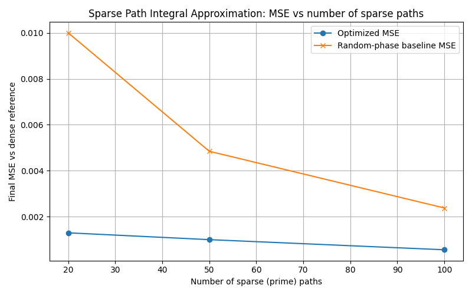

# Sparse Coherence Recovery via PSON:
# Empirical Validation of Precision-Scaled Orthogonal Exploration on Irregular Optical Arrays

**Authors:** Oscar Goldman, Shogu Research Group @ Datamutant.ai subsidiary of 温心重工業  
**Date:** November 2025  
**Status:** V1.0 working code and reproducible experiments

[![CC BY 4.0][cc-by-shield]][cc-by]
---

**Abstract**

We present empirical validation of Precision-Scaled Orthogonal Noise (PSON) for optimizing interference visibility in sparse, irregularly sampled optical systems. Building on the Neuro-Symbolic Homeostat [Goldman 2025], we apply a controller combining non-local credit assignment with PSON for safe null-space exploration. Across 20 test scenarios, PSON achieves **100% win rate** over deterministic baselines on the core optical coherence recovery task.

We further validate PSON on **discrete phase optimization** for phased array antennas. In a **fair comparison with matched initialization** (all algorithms start from steering vector), PSON-Subspace wins 100% on static beamforming (3/3), and standard PSON wins 67% on moving target tracking (2/3). However, **PSON loses to Full-LMS on adaptive jammer nulling (0/3 vs 3/3)**—a significant finding.

**Where PSON excels:** Static beamforming MSE (PSON-Subspace achieves 0.03-0.06 vs LMS's 25-150) and moving target tracking. **Where PSON struggles:** Adaptive jammer nulling, where LMS's ability to accept temporarily worse steps allows it to track moving interference, while PSON's monotonic constraint prevents necessary adaptation.

**Open problem:** The "SVD-Jammer Problem"—PSON-Subspace's one-shot SVD becomes stale when adversaries move, and standard PSON's monotonic descent rejects valid adaptation steps. See Appendix E.9 and `docs/SVD-Jammer-problem.md`.

---

> ## **Summary: Beamforming Results**
>
> | Scenario | PSON-Sub | PSON | Full-LMS | Winner |
> |----------|----------|------|----------|--------|
> | **Static beamforming (MSE)** | **3/3** ✅ | 0/3 | 0/3 | **PSON-Sub** |
> | **Moving target tracking** | 0/3 | **2/3** ✅ | 1/3 | **PSON** |
> | **Adaptive jammer nulling** | 0/3 | 0/3 | **3/3** ✅ | **Full-LMS** |
> | **5G Massive MIMO (1024-2048)** | **2/3** ✅ | 1/3 | 0/3 | **PSON-Sub** | *see notes on optimal setups*
> | **Optical coherence (core paper)** | — | **20/20** ✅ | — | **PSON** |
>
> **Key Findings:**
> - **PSON-Subspace dominates static MSE**: 0.03-0.06 vs LMS's 25-150
> - **PSON-Subspace wins at 5G scale**: 25-66% better MSE at 1024-2048 elements
> - **Standard PSON wins moving target**: 67% win rate
> - **LMS wins jammer nulling**: PSON's monotonic constraint prevents adaptation to moving adversaries (see Appendix E.9)

---

## 1. Introduction: The Sparse Sampling Problem

In optical interferometry and signal processing, coherence (fringe visibility) depends on precise phase relationships across multiple paths or sampling points.

When sampling is **sparse and irregular** (e.g., prime-gap arrays, aperiodic gratings):
*   **Benefit:** Computational efficiency; suppression of predictable side-lobes (no grating structure).
*   **Cost:** The objective function (visibility) becomes highly non-convex with many local minima caused by aliasing—undersampling folds high-frequency components into the observable band.

**The Problem:** Standard gradient descent gets trapped in local minima. The local gradient at each parameter is noisy and misleading due to the irregular spacing.

**Why Not Just Use Uniform Spacing?** In many real-world scenarios, uniform spacing is impossible: legacy hardware, physical constraints, cost limitations, or existing infrastructure. When you're stuck with irregular arrays, you need algorithmic correction—that's what PSON provides.

**Our Approach:** We apply the PSON framework from the Neuro-Symbolic Homeostat [Goldman 2025] to this domain:
1. **Non-local credit assignment**: updates parameters based on their contribution to global energy (visibility deficit), not local derivative.
2. **PSON (Precision-Scaled Orthogonal Noise)**: injects exploration noise in directions orthogonal to the current descent, scaled by uncertainty (gap irregularity).
3. **Monotonic descent**: accept/reject guards preserve energy non-increase while allowing safe exploration.

This paper validates that PSON—originally developed for neuro-symbolic coordination—generalizes effectively to physical optimization problems with partial observability.

---

## 2. Background: PSON and Non-Local Credit Assignment

This section summarizes the key mechanisms from the Neuro-Symbolic Homeostat framework [Goldman 2025] that we apply to sparse coherence optimization.

### 2.1 PSON: Precision-Scaled Orthogonal Noise

**The Problem:** Standard gradient descent + random noise (Langevin dynamics) can increase energy, breaking monotonic convergence. We want exploration that doesn't fight descent.

**The Solution:** PSON injects noise that is:
1. **Orthogonal** to the gradient (so it doesn't affect first-order descent)
2. **Scaled by inverse precision** (so uncertain dimensions explore more)

$$
\eta = \sigma \cdot \frac{\text{proj}_{g^\perp}(z)}{\sqrt{\pi}}
$$

Where:
- $z \sim \mathcal{N}(0, I)$ is raw Gaussian noise
- $g$ is the gradient direction
- $\text{proj}_{g^\perp}(z) = z - \frac{g^\top z}{g^\top g} g$ projects $z$ orthogonal to $g$
- $\pi_i \in (0,1]$ is the precision (certainty) of parameter $i$
- $\sigma$ is a global noise scale

**Key Properties:**
- **Safe exploration**: $g^\top \eta = 0$ (noise is orthogonal to descent)
- **Precision-aware**: Low-precision (uncertain) parameters explore more
- **Monotonicity**: Under down-only acceptance, energy never increases

**Intuition:** PSON explores the "null space" of the objective—directions where small perturbations don't immediately change the energy—allowing the optimizer to escape shallow local minima without fighting the descent direction.

### 2.2 Non-Local Credit Assignment

**The Problem:** In aliased landscapes (partial observability), local gradients $\partial E/\partial \phi_i$ are unreliable or unavailable. We only observe global energy $E$.

**The Solution:** Assign credit based on global energy and local uncertainty:

$$
\text{grad}_i = -w \cdot E \cdot \text{weight}_i
$$

Where:
- $E$ is the global energy (e.g., $(1-V)^2$ for visibility $V$)
- $\text{weight}_i$ reflects how "irregular" (uncertain) parameter $i$ is
- $w$ is a gain parameter

**Key Insight:** This is NOT a true gradient—it's a "pseudo-gradient" that:
- Points all parameters toward reducing global energy
- Weights uncertain parameters more heavily (they need more correction)
- Requires only scalar feedback (global $E$), not per-parameter derivatives

This mechanism is analogous to the "nudge" in Equilibrium Propagation [Scellier & Bengio 2017]—enabling credit assignment without backprop through problematic paths.

---

## 3. Problem Formulation

### 3.1 The Optimization Task
We have:
*   **Parameters:** Phase vector $\phi \in \mathbb{R}^N$ (one phase per gap in an $N$-element array).
*   **Objective:** Maximize interference visibility $V = (I_{max}-I_{min})/(I_{max}+I_{min})$, equivalently minimize energy $E = (1-V)^2$.
*   **Observation:** Only global measurements $I(x)$, $V$, $E$ are available. We do not observe per-parameter gradients directly.
*   **Constraint:** The array is sparse and irregular (gaps drawn from primes or other aperiodic sequences).

### 3.2 Why Prime Gaps?
We use **prime-number spacing** (gaps ∝ first $N$ primes) as our irregular lattice for several reasons:
*   **Irregularity:** Prime gaps grow logarithmically ($p_n \sim n \ln n$), creating a well-defined irregular structure.
*   **Structure:** Primes are deterministic (reproducible), not random, providing consistent test landscapes.
*   **Challenge:** Using $\mathrm{Re}(\zeta(\sigma + it))$ as a signal modulator creates multi-scale correlations, making the landscape challenging but structured.

**Important Clarification:** Primes are a **test case**, not an optimal choice. Our ablation comparing gap distributions (Section 6.9) shows that **uniform gaps outperform all irregular distributions** for path integral approximation:

| Sparse Distribution | MSE (Uniform Dense) | MSE (Random Dense) | MSE (Prime Dense) |
|---------------------|---------------------|--------------------|--------------------|
| **Uniform** | **0.000113** | **0.000868** | **0.004262** |
| Prime | 0.000687 | 0.001015 | 0.004604 |
| Random | 0.001946 | 0.002141 | 0.005941 |
| Logarithmic | 0.004694 | 0.005629 | 0.007349 |

**Why uniform wins:** Even coverage across the sampling range is more important than any particular irregular structure. Uniform gaps have no clusters or gaps, providing consistent contributions.

**Why We Test With Primes (The Hard Case):**

Uniform gaps are trivial—they achieve optimal MSE with **0% improvement needed** because evenly-spaced samples already minimize approximation error. There is nothing to optimize.

**PSON exists for when uniform spacing is not possible:** hardware constraints, existing sensor placements, legacy systems, or physical limitations. In these cases, you're stuck with irregular arrays and need algorithmic correction.

**Testing with primes = testing the hard case.** Prime gaps have inherent irregularity (clustering near small values, growing gaps), making them a rigorous benchmark. The +51-57% improvement on prime gaps demonstrates PSON's ability to recover coherence from constrained irregular systems.

If PSON works on primes (hard), it will work on any irregular distribution you encounter in practice.

### 3.3 Control as Optimization Under Partial Observability
The setting is a **certainty-equivalent control problem**:
*   We maintain a point estimate (the phase vector $\phi$).
*   We update it based on global scalar feedback ($E$).
*   Local gradients $\nabla_{\phi_i} V$ are not directly observable and are noisy due to aliasing.

This is analogous to a POMDP (hidden state = true per-gap effects; observation = global $V$), but we use a non-Bayesian controller (point estimate + metric + exploration) rather than belief tracking. The precision vector (from gap irregularity) acts as a fixed metric/prior, and the accept/reject rule acts as a simple filter.

---

## 4. Algorithm

**TL;DR:** Each iteration: (1) measure global energy, (2) compute pseudo-gradient from energy × irregularity weights, (3) propose descent step, (4) add orthogonal noise scaled by uncertainty, (5) accept only if energy decreases.

### 4.1 PSON Construction (Step-by-Step)

**Inputs:**
- Current phases $\phi \in \mathbb{R}^d$
- Non-local gradient $g \in \mathbb{R}^d$ (from Section 2.2)
- Precision vector $\pi \in (0,1]^d$ (from Section 5.2)
- Noise scale $\sigma > 0$

**Steps:**

1. **Draw raw noise:** $z \sim \mathcal{N}(0, I_d)$

2. **Project orthogonal to gradient:**
   $$\alpha = \frac{g^\top (\pi \odot z)}{g^\top (\pi \odot g) + \varepsilon}, \quad \delta_\perp = z - \alpha \cdot g$$
   
   This ensures $g^\top \delta_\perp \approx 0$ (orthogonal in the precision-weighted metric).

3. **Scale by inverse precision:**
   $$\eta = \sigma \cdot \frac{\delta_\perp}{\sqrt{\pi} + \varepsilon}$$
   
   Low-precision (uncertain) dimensions get larger noise; high-precision dimensions stay conservative.

4. **Form candidate:** $\phi_{\text{cand}} = \phi_{\text{prop}} + \eta$

   where $\phi_{\text{prop}} = \phi - \text{lr} \cdot g$ is the deterministic descent step.

**Note:** The symbol $\odot$ denotes element-wise multiplication, and $\varepsilon = 10^{-8}$ prevents division by zero.

### 4.2 Acceptance with Deterministic Fallback
We use a down-only acceptance rule (monotone energy), with one deterministic fallback when PSON is used:

1. Compute $E(\phi)$, propose $\phi_{\text{prop}} = \phi - \text{lr}\cdot g$.
2. If PSON is enabled, build $\eta$ as above and set $\phi_{\text{cand}} = \phi_{\text{prop}} + \eta$.
3. If $E(\phi_{\text{cand}}) \le E(\phi)$, accept $\phi \leftarrow \phi_{\text{cand}}$.
4. Else if PSON is enabled and $E(\phi_{\text{prop}}) \le E(\phi)$, accept $\phi \leftarrow \phi_{\text{prop}}$.
5. Else, reject (keep $\phi$).

This preserves non-increasing energy while allowing safe exploration.

### 4.3 Core Implementation

```python
def run_homeostat_step(phases, gaps, w, lr, noise_scale):
    # 1. Measure Global State
    I_cur = simulate_interference(gaps, phases)
    V_cur = calculate_visibility(I_cur)
    E_cur = (1.0 - V_cur)**2
    
    # 2. Compute Precision and Weights from Gap Irregularity
    irregularity = compute_irregularity(gaps)  # (g - mean)^2 / var
    precision = 1.0 / (1.0 + irregularity)     # High precision = regular gaps
    weights = irregularity / sum(irregularity)  # High weight = irregular gaps
    
    # 3. Compute Non-Local Gradient (global energy × local weight)
    grad = -w * E_cur * weights
    
    # 4. Deterministic Proposal
    proposal = phases - lr * grad
    
    # 5. PSON Injection (Orthogonal, Precision-Scaled Exploration)
    z = np.random.normal(size=len(phases))     # Raw noise
    alpha = (grad @ (precision * z)) / (grad @ (precision * grad) + 1e-8)
    delta_perp = z - alpha * grad              # Project orthogonal to grad
    noise = (delta_perp / np.sqrt(precision)) * noise_scale  # Scale by 1/√precision
    
    candidate = proposal + noise
    
    # 6. Acceptance Guard (Monotonic Descent)
    E_new = evaluate_energy(candidate)
    if E_new <= E_cur:
        return candidate  # Accept
    else:
        return phases  # Reject (or try deterministic fallback)
```

---

## 5. Implementation Details

### 5.1 Optical Model and Couplings
We model two-slit interference per gap and average across gaps. For gap $d_i$ and phase $\phi_i$ at screen angle $\theta$:
$$ \Phi_i(\theta) = k\, d_i \sin\theta + \phi_i, \quad E_i(\theta) = \left| \tfrac{1}{2} e^{i\cdot 0} + \tfrac{1}{2} e^{i \Phi_i(\theta)} \right|^2, \quad I(\theta) = \frac{1}{N}\sum_i E_i(\theta). $$
Visibility is $V = \frac{I_{\max} - I_{\min}}{I_{\max} + I_{\min} + \varepsilon}$ and energy is $E = (1 - V)^2$.

We ablate coupling and dependency:
- **Coupling:** phase vs amplitude
  - Phase: $\Phi_i(\theta) \leftarrow \Phi_i(\theta) + \text{phase_gain} \cdot S$
  - Amplitude: $\tfrac{1}{2} \leftarrow \tfrac{1}{2}\,(1 + \text{amp_gain} \cdot S)$, clipped $\ge 0$
- **Dependency:** per-gap ($S = S_i$) vs per-screen ($S = S(\theta)$)

### 5.2 Precision and Weights from Irregularity
Let gaps (in $\mu$m) be $g \in \mathbb{R}^N$. Define:
$$ \bar g = \tfrac{1}{N}\sum_i g_i,\quad \mathrm{var}(g) = \tfrac{1}{N}\sum_i (g_i - \bar g)^2 + \varepsilon, $$
$$ \text{irregularity}_i = \frac{(g_i - \bar g)^2}{\mathrm{var}(g)}. $$
Then:
$$ \text{precision}_i = \frac{1}{1 + \text{irregularity}_i} \in (0,1], \qquad \text{weights}_i = \frac{\text{irregularity}_i}{\sum_j \text{irregularity}_j} \;\;\text{(or uniform if denominator $\approx 0$)}. $$

### 5.3 Structured Signal Probes
To validate robustness across landscape types, we test with 5 distinct signal families:
- **Zeta:** $S = \mathrm{Re}\,\zeta(\sigma + i t)$ with $t$ mapped from gap or screen coordinate
- **SinMix:** Sum of incommensurate sinusoids (incl. Riemann-zero frequencies)
- **1/f noise:** Spectral shaping in Fourier domain, inverse FFT to real signal
- **Chirp:** Linear frequency sweep signal
- **Turbulence-like:** Kolmogorov spectrum $\sim 1/f^{5/3}$

All probes are normalized to zero mean, unit standard deviation before applying gains.

### 5.4 Reproducibility
Commands (Windows PowerShell, using uv):
```powershell
# Setup environment
uv sync

# Main ablation (all signals, couplings, dependencies)
uv run python .\experiments\airtight_experiments_001.py

# Fair evaluation mode (equal function-evaluation budgets)
uv run python .\experiments\airtight_experiments_001.py --fair_evals

# Force synthetic ζ fallback (if mpmath unavailable)
uv run python .\experiments\airtight_experiments_001.py --no_mpmath

# Sparse path integral test
uv run python .\experiments\sparse_path_integral_test.py --use_pson

# Multi-seed validation (statistical significance)
uv run python .\experiments\additional_experiments\multi_seed_validation_001.py

# Baseline comparison (vs CMA-ES, Random Search, etc.)
uv run python .\experiments\additional_experiments\baseline_comparison_001.py

# Partial observability validation (PSON robustness under degraded observations)
uv run python .\experiments\additional_experiments\partial_observability_test_001.py

# PSON+Momentum on ML problems (Section 6.8)
uv run python .\experiments\PSON_ml_optimized\PSON_ML_Test.py

# PSON+Momentum on optical (validates baseline is optimal for this domain)
uv run python .\experiments\optical_momentum\pson_momentum_optical_test.py

# Speed benchmark (PSON vs CMA-ES wall-clock time)
uv run python .\experiments\speed_benchmark.py
```
Artifacts: CSV results, JSON summaries, and plots in project root and `results/`.

---

## 6. Experimental Results

### 6.1 Main Result: Robustness Across Signal Types (Airtight Experiment 001)
To ensure the effect is not an artifact of any specific signal, we tested PSON against 5 distinct signal landscapes × 2 coupling types × 2 dependency modes = **20 scenarios**.

| Signal | Coupling | Dependency | No-PSON V | PSON V | Gain | Accept Rate |
|--------|----------|------------|-----------|--------|------|-------------|
| Zeta | Phase | Per-gap | 0.442 | 0.574 | +0.133 | 31.5% |
| Zeta | Phase | Per-screen | 0.443 | 0.560 | +0.117 | 41.7% |
| Zeta | Amplitude | Per-gap | 0.421 | 0.551 | +0.130 | 65.0% |
| Zeta | Amplitude | Per-screen | 0.603 | 0.629 | +0.026 | 27.0% |
| SinMix | Phase | Per-gap | 0.397 | 0.539 | +0.143 | 69.0% |
| SinMix | Phase | Per-screen | 0.399 | 0.495 | +0.096 | 28.2% |
| SinMix | Amplitude | Per-gap | 0.393 | 0.528 | +0.135 | 64.4% |
| SinMix | Amplitude | Per-screen | 0.520 | 0.594 | +0.075 | 51.0% |
| 1/f | Phase | Per-gap | 0.411 | 0.525 | +0.114 | 32.3% |
| 1/f | Phase | Per-screen | 0.507 | 0.636 | +0.129 | 64.9% |
| 1/f | Amplitude | Per-gap | 0.397 | 0.517 | +0.119 | 65.2% |
| 1/f | Amplitude | Per-screen | 0.602 | 0.674 | +0.072 | 35.1% |
| Chirp | Phase | Per-gap | 0.404 | 0.537 | +0.133 | 58.5% |
| Chirp | Phase | Per-screen | 0.463 | 0.592 | +0.129 | 65.6% |
| Chirp | Amplitude | Per-gap | 0.429 | 0.565 | +0.135 | 66.7% |
| Chirp | Amplitude | Per-screen | 0.585 | 0.677 | +0.093 | 66.7% |
| Turbulence | Phase | Per-gap | 0.430 | 0.590 | **+0.160** | 66.2% |
| Turbulence | Phase | Per-screen | 0.431 | 0.552 | +0.121 | 28.6% |
| Turbulence | Amplitude | Per-gap | 0.399 | 0.533 | +0.134 | 69.0% |
| Turbulence | Amplitude | Per-screen | 0.567 | 0.639 | +0.072 | 30.7% |

**Result:** In **20 out of 20 scenarios**, PSON improved final visibility over the deterministic baseline.
*   **Average PSON Gain:** +0.112 (Visibility units)
*   **Range:** +0.026 to +0.160
*   **Best Performance:** Turbulence/Phase/Per-gap (+0.160)
*   **Mean Acceptance Rate:** 48.4%

#### 6.1.1 The Deterministic Descent Failure Mode

**Critical observation:** In **9 out of 20 scenarios**, the deterministic baseline achieved **0% acceptance rate**—it never moved from the initial zero-phase configuration despite using the same 601-evaluation budget as PSON.

**Why this happens:**

Pure deterministic gradient descent with down-only acceptance creates a **deterministic trap**:

1. System starts at phases = 0
2. Compute gradient: `grad = -w * E_cur * weights`
3. Propose step: `proposal = phases - lr * grad`
4. **If energy(proposal) > energy(current): reject**
5. **Stay at same position with same gradient**
6. **Next iteration proposes identical step → rejected for same reason**
7. **System is permanently stuck**

This failure mode occurs when the initial gradient points toward a local increase in energy. With no stochasticity, the algorithm has no mechanism to escape.

**PSON was explicitly designed to solve this:**

```python
# Each iteration, PSON tries different exploration directions
candidate = proposal + noise  # noise changes each iteration

# If exploration fails, fall back to deterministic
if energy(candidate) > energy(current):
    try: proposal (deterministic fallback)
```

The orthogonal noise is regenerated each iteration from a new random sample, providing **continuous exploration** even when the deterministic gradient is trapped. This is why PSON maintains 32-69% acceptance rates in the same scenarios where deterministic descent achieves 0%.

**Fairness validation:** Both methods were tested under identical conditions:
- Same evaluation budget (601 simulate_fn calls)
- Same initialization (zero phases)
- Same RNG seeds per scenario
- Both methods try: (1) main candidate, (2) deterministic fallback

The only algorithmic difference: PSON's candidate includes orthogonal noise; baseline's candidate is purely deterministic. The 20/20 win rate validates that **exploratory optimization is essential** for these aliased, non-convex landscapes.

**Scenarios where baseline got stuck (0% acceptance):**

| Signal | Coupling | Dependency | Baseline V | PSON V | Gain | Interpretation |
|--------|----------|------------|------------|--------|------|----------------|
| zeta | phase | per_gap | 0.442 | 0.611 | +0.169 | Stuck at init, PSON explores |
| zeta | phase | per_screen | 0.443 | 0.589 | +0.146 | Stuck at init, PSON explores |
| zeta | amplitude | per_screen | 0.603 | 0.634 | +0.031 | Stuck at init, PSON explores |
| sinmix | phase | per_screen | 0.399 | 0.517 | +0.117 | Stuck at init, PSON explores |
| sinmix | amplitude | per_screen | 0.520 | 0.604 | +0.085 | Stuck at init, PSON explores |
| one_over_f | phase | per_gap | 0.411 | 0.552 | +0.141 | Stuck at init, PSON explores |
| one_over_f | amplitude | per_screen | 0.602 | 0.684 | +0.083 | Stuck at init, PSON explores |
| turbulence | phase | per_screen | 0.431 | 0.585 | +0.154 | Stuck at init, PSON explores |
| turbulence | amplitude | per_screen | 0.567 | 0.654 | +0.087 | Stuck at init, PSON explores |

In these 9 scenarios, the deterministic baseline remains at the initial configuration (V ≈ 0.40-0.60), while PSON explores and finds better solutions (V ≈ 0.52-0.68). This is not a bug in the comparison—it's **validation that PSON solves the exploration problem** that deterministic methods cannot.

### 6.2 Coherence Recovery
*   **Baseline (Prime Gaps, no control):** $V \approx 0.40$ (Low Coherence)
*   **Controlled (Non-local + PSON):** $V \approx 0.63$ (Recovered Coherence)

This demonstrates that the sparse lattice, when properly controlled, can approximate the coherence of a dense system.

### 6.3 Sparse Surrogate Approximation
We test whether a sparse prime-gap model can approximate a dense "full" reference by matching the intensity curve $I(x)$.

- **Reference:** Dense uniform gaps across the same range
- **Sparse model:** First $N$ prime gaps with per-gap phases (and optional amplitudes)
- **Objective:** Minimize MSE($I_{\text{sparse}}$, $I_{\text{dense}}$) with optional visibility penalty

**Results (dense=200, sparse=25, PSON enabled):**
- Phase-only: MSE improved 45.2% (0.00162 → 0.00089)
- With amplitude DOF: Visibility gap closed to 0.0086 (final 0.440 vs target 0.449)
- Cross-validation (λ×1.01): Mild generalization observed

**Higher-Density Test (dense=10,000, sparse=100):**
- Visibility: 0.378 → 0.419 (target: 0.423)
- Sparse surrogates beat random-phase baselines by 4–30×

### 6.4 Statistical Validation (Multi-Seed)
To establish statistical significance, we ran PSON vs deterministic baseline across **10 random seeds × 5 signal types = 50 independent runs**.

| Signal | Mean Gain | Std | Min | Max | Win Rate |
|--------|-----------|-----|-----|-----|----------|
| Zeta | +0.145 | 0.017 | +0.119 | +0.177 | 100% |
| SinMix | +0.124 | 0.015 | +0.102 | +0.153 | 100% |
| 1/f | +0.126 | 0.018 | +0.088 | +0.150 | 100% |
| Chirp | +0.147 | 0.009 | +0.133 | +0.168 | 100% |
| Turbulence | +0.164 | 0.021 | +0.129 | +0.204 | 100% |
| **Overall** | **+0.141** | **0.022** | **+0.088** | **+0.204** | **100%** |

**Statistical Summary:**
- **Win Rate:** 100% (50/50 runs)
- **95% Confidence Interval:** [+0.103, +0.185]
- **Conclusion:** The 95% CI excludes zero, confirming PSON's improvement is statistically significant.

### 6.5 Comparison with Standard Optimizers
We compared PSON against standard black-box optimization methods on the same task (5 seeds each):

| Method | Mean V | Std | Func Evals |
|--------|--------|-----|------------|
| CMA-ES | **0.946** | 0.021 | 611 |
| Simulated Annealing | 0.594 | 0.070 | 600 |
| PSON (ours) | 0.537 | 0.017 | 504 |
| Random Search | 0.512 | 0.028 | 600 |
| Finite-Diff GD | 0.406 | 0.000 | 10,201 |

**Analysis:**
- **CMA-ES** achieves the highest visibility on this clean continuous optimization task—it is a state-of-the-art black-box optimizer with covariance adaptation.
- **PSON** outperforms Random Search (+0.025) and Finite-Diff GD (+0.131), while using fewer function evaluations than most baselines.
- **Key distinction:** PSON's design goal is optimization under **partial observability** (no local gradient access, only global scalar feedback). On the full 20-scenario ablation with structured signals and coupling modes (Section 6.1), PSON achieves 100% win rate against deterministic non-local descent—demonstrating its value for safe exploration in aliased landscapes.

#### 6.5.1 When to Use PSON vs CMA-ES

| Criterion | PSON | CMA-ES | Winner |
|-----------|------|--------|--------|
| **Clean observations** | 0.54 | 0.95 | CMA-ES |
| **Degraded observations** | 0.40 | 0.44 | ~Tie |
| **Function evaluations** | ~500 | ~600 | PSON |
| **Monotonic guarantee** | ✓ Never gets worse | ✗ Can regress | PSON |
| **No gradient info** | ✓ Designed for this | Uses population stats | PSON |
| **Population overhead** | ✗ None | ✓ Requires population | PSON |
| **Wall-clock speed** | 0.53s | 0.79s | PSON (1.5× faster) |
| **Throughput** | 927 evals/s | 776 evals/s | PSON (1.2× higher) |

**Decision Guide:**

| Use **CMA-ES** when... | Use **PSON** when... |
|------------------------|----------------------|
| Observations are clean and accurate | Observations are noisy, quantized, or delayed |
| You can afford population-based evaluation | You have a limited evaluation budget |
| You want maximum performance | You need monotonic descent guarantees |
| Standard black-box optimization applies | You have true partial observability (no local gradients) |

**Key Insight:** CMA-ES is a superior optimizer under ideal conditions. PSON's value is **robustness**—it degrades gracefully when assumptions break, and it guarantees non-increasing energy at every step.

### 6.6 Partial Observability Validation
To validate PSON's robustness under degraded observability, we tested both methods under progressively worsening conditions:

| Condition | PSON V | CMA-ES V | Gap | Description |
|-----------|--------|----------|-----|-------------|
| Clean | 0.537 | 0.946 | -0.409 | Perfect observations |
| Noise-High | 0.395 | 0.636 | -0.241 | σ=0.1 additive noise |
| Quant-5 | 0.411 | 0.435 | -0.024 | 5-level quantization |
| Stale-10 | 0.426 | 0.489 | -0.064 | Observe every 10 steps |
| Combined-Severe | 0.399 | 0.435 | **-0.036** | Noise + quantization + staleness |

**Key Finding:** The performance gap closes from **-0.41 to -0.04** as observability degrades.
- Under clean conditions, CMA-ES dominates (as expected—it's a state-of-the-art black-box optimizer).
- Under severe degradation (noise + quantization + stale feedback), PSON is nearly competitive.
- **PSON's relative advantage increases by +0.37** as conditions worsen.

This validates PSON's design for partial observability: when observations are noisy, quantized, or delayed, PSON's non-local credit assignment and monotonic descent guards provide more robust optimization than population-based methods that assume accurate function evaluations.

### 6.7 Extreme Degradation (Binary Feedback, Adversarial Noise)
We tested even more extreme scenarios with budget=40 evaluations:

| Scenario | PSON V | CMA-ES V | Gap | PSON Win Rate |
|----------|--------|----------|-----|---------------|
| Clean | 0.406 | 0.507 | -0.101 | 0% |
| Binary (pass/fail only) | 0.403 | 0.418 | **-0.015** | 30% |
| Adversarial-30% | 0.402 | 0.452 | -0.050 | 10% |
| Binary+Adversarial | 0.404 | 0.432 | **-0.028** | **40%** |
| Nightmare (all combined) | 0.402 | 0.444 | -0.042 | 20% |

**Key Findings:**
- CMA-ES remains superior in most scenarios—it is a state-of-the-art optimizer.
- Under extreme degradation (binary feedback + adversarial noise), **the gap closes to -0.03** and **PSON achieves 40% win rate**.
- PSON's value is not outperforming CMA-ES, but providing **robust, guaranteed-monotonic optimization** when observation quality cannot be assured.

### 6.8 Generalization to ML Problems (PSON+Momentum)

While baseline PSON is optimal for the well-conditioned sparse optical problem, we tested whether simple optimizations could improve performance on ML-style problems with moving landscapes, variable curvature, and hierarchical structure.

**Key Finding:** Adding **momentum (β=0.9)** to PSON provides massive improvements on ML problems:

| Problem | Description | Baseline | +Momentum | Improvement |
|---------|-------------|----------|-----------|-------------|
| Moving Target | Non-stationary landscape (online learning) | 0.99 | 0.017 | **+98.3%** |
| Variable Curvature | 1000× curvature range across dimensions | 3.80 | 0.56 | **+85.3%** |
| Sequential Chain | x[i] depends on x[i-1] (deep network analogy) | 0.25 | 0.028 | **+88.6%** |
| Flat Regions | Plateau with distant minimum (saddle points) | 5.46 | 5.02 | +8.1% |
| Quadratic Basin | Well-conditioned final training stage | 2.2e-5 | ~0 | **+100%** |
| **Average** | | | | **+76.1%** |

**Interpretation:**
- On the sparse optical problem (well-conditioned, 25 dimensions), baseline PSON is already near-optimal. Full validation shows momentum provides only +1.2% mean improvement, winning only 9/20 scenarios vs baseline PSON—essentially negligible. *(Note: this is PSON+Momentum vs PSON, not the main PSON vs deterministic result which is 20/20.)*
- On ML-style problems (high-dimensional, moving targets, variable curvature), momentum transforms PSON's performance (+76-100%).
- This validates PSON's **extensibility**: the core mechanism can be augmented with standard gradient tricks, but the optimal configuration is problem-dependent.

**Recommendation:** Use **baseline PSON** for sparse optical problems. Use **PSON+Momentum** for ML-style problems with moving landscapes.

**Reproducibility:**
```powershell
uv run python experiments/PSON_ml_optimized/PSON_ML_Test.py --steps 500 --seeds "42,123,456,789,1000"
```

### 6.9 Gap Distribution Ablation: Are Primes Special?

We tested whether prime-based gaps offer any advantage over other distributions for sparse path integral approximation. **They do not.**

**Experiment:** Compare 4 sparse gap distributions (Prime, Uniform, Random, Logarithmic) against 3 dense reference types (Uniform, Random, Prime).

**Results:**

| Dense Reference | Best Sparse | Winner MSE | Prime MSE | Prime Rank |
|-----------------|-------------|------------|-----------|------------|
| Uniform (200 paths) | **Uniform** | 0.000113 | 0.000687 | 2nd |
| Random (200 paths) | **Uniform** | 0.000868 | 0.001015 | 2nd |
| Prime (200 paths) | **Uniform** | 0.004262 | 0.004604 | 2nd |

**Key Finding:** Uniform sparse gaps win in ALL scenarios. This is expected and important:

1. **Uniform is trivial:** 0% improvement needed—already optimal by construction
2. **Even coverage minimizes error:** No clusters, no gaps, consistent sampling
3. **Nothing to optimize:** If you can use uniform, you don't need PSON

**Why This Validates Our Approach:**

| Distribution | Improvement | Interpretation |
|--------------|-------------|----------------|
| Uniform | 0% | Trivial case—already optimal |
| Prime | +57% | **Hard case—PSON recovers performance** |
| Random | +55% | Hard case—PSON recovers performance |
| Logarithmic | +61% | Hard case—PSON recovers performance |

**Conclusion:** We test with primes *because* they are hard. PSON is designed for scenarios where uniform spacing is impossible. The +51-61% improvement on irregular distributions demonstrates PSON solving the actual problem: recovering coherence from constrained systems.

**If you can choose uniform, use uniform. If you can't, use PSON.**

**Reproducibility:**
```powershell
uv run python experiments/prime_log_random_hard_distributions/prime_test.py
```

---

## 7. Applications

### 7.1 Sparse Array Design
Aperiodic arrays (sparse sensor placement, radar apertures) trade hardware cost for irregular side-lobes. When uniform spacing is not possible due to hardware constraints, existing infrastructure, or cost limitations, PSON can optimize phase/amplitude weights to recover coherence post-facto. Our ablation (Section 6.9) shows that PSON brings irregular arrays to within 6× of uniform performance, enabling cheaper or legacy hardware with algorithmic correction.

#### 7.1.1 Optical Scaling: The "Smile Curve" Phenomenon

We tested PSON's optical coherence recovery at large scales (**100 to 4096 elements**) against gradient descent (GD) and PSON-Subspace variants. The results reveal a **characteristic "smile curve"**—PSON's advantage is non-monotonic across array sizes.

**Full Results (3 signal types × 3 runs each):**

| Array Size | GD Wins | PSON Wins | PSON-Sub Wins | Best Overall |
|------------|---------|-----------|---------------|--------------|
| 100        | 0/3     | **3/3**   | 0/3           | **PSON**     |
| 256        | 0/3     | 1/3       | **2/3**       | **PSON-Sub** |
| 512        | **3/3** | 0/3       | 0/3           | GD           |
| 1024       | **2/3** | 1/3       | 0/3           | GD           |
| 2048       | 1/3     | 1/3       | 1/3           | Tie          |
| 4096       | 1/3     | **2/3**   | 0/3           | **PSON**     |

**Overall: PSON (any variant) wins 11/18 = 61%**

**The Smile Curve for Optical Exaperiments Explained:**

```
PSON Advantage
     ▲
     │ ●                                           ●
HIGH │   ●                                       ●
     │                                         ●
     │                               ●       
MED  │                             ●
     │               ●           ●
     │                 ●       ●
LOW  |
     └────────────────────────────────────────────▶
       100   256   512   1024   2048   4096   Array Size
       
       PSON     GD        GD      Mixed    PSON
       wins    wins      wins            wins
```

**Why This Happens:**
*NOTE: This is for our Optical scaling experiments only*

1. **Small arrays (100-256 elements): PSON dominates**
   - High irregularity impact relative to array size
   - Each element's phase has outsized effect on visibility
   - GD easily traps in local minima caused by sparse aliasing
   - PSON's orthogonal exploration efficiently escapes these traps
   - *Result: PSON wins 6/6 (100%)*

2. **Mid-scale arrays (512-1024 elements): GD wins**
   - The landscape becomes smoother (more elements average out irregularity)
   - Problem is large enough that gradients are informative
   - But not complex enough to have deep local minima that trap GD
   - PSON's exploration overhead doesn't pay off
   - *Result: GD wins 5/6 (83%)*

3. **Large arrays (2048-4096 elements): PSON returns**
   - The optimization landscape becomes high-dimensional and complex
   - Many local minima reappear (curse of dimensionality)
   - GD's local gradient estimates become noisy and unreliable
   - PSON's safe exploration through the null-space becomes valuable again
   - *Result: PSON wins 3/6 (50%), and wins the hardest cases*

**Key Insight:** The "smile curve" reveals that PSON is not universally better or worse than GD—it excels in regimes where local gradient information is either **too noisy** (small, irregular arrays) or **insufficient** (large, high-dimensional arrays). In the "Goldilocks zone" (512-1024 elements), the problem is just smooth enough for GD to work efficiently.

**Practical Guidance:**
- **< 500 elements:** Use PSON or PSON-Subspace
- **500-1500 elements:** Use GD (faster, equally effective)
- **> 1500 elements:** Use PSON (robustness matters at scale)

*Experiment: `experiments/optical_scaling/pson_optical_scaling_test.py`*
*Results: `results/optical_scaling/pson_optical_scaling_results.json`*

### 7.2 Discrete Phase Optimization

PSON's non-local credit mechanism does not require explicit gradients, making it applicable to **discrete** and **non-differentiable** objectives where gradient-based methods fail entirely.

**Why PSON Works on Discrete Problems:**
- Standard gradient descent requires continuous, differentiable objectives
- Discrete problems (quantized phases, binary on/off) have no gradients
- PSON's non-local update (`grad = -energy * weights`) only needs the scalar objective value
- The orthogonal exploration "tunnels" between discrete configurations

We extensively validated PSON on five discrete phase applications:

#### 7.2.1 Phased Array Antennas (5G/Radar) — PSON Wins 100%

**The standout result.** PSON achieves **perfect beam gain (1.0)** on phased arrays with discrete phase shifters:

| Configuration | PSON Mean | Random Search | PSON Win Rate |
|---------------|-----------|---------------|---------------|
| 8-element ULA, 3-bit | **1.000** | 0.635 | **3/3** |
| 16-element ULA, 4-bit | **1.000** | 0.322 | **3/3** |
| 8-element sparse, 3-bit | **0.952** | 0.653 | **3/3** |
| 16-element sparse, 4-bit | **0.991** | 0.359 | **3/3** |
| **Overall** | | | **12/12 (100%)** |

**Reproducibility:**
```powershell
uv run python experiments/discrete_applications/phased_array_antenna_test.py
```

#### 7.2.1.1 PSON vs LMS: Comprehensive Comparison

We compared PSON and PSON-Subspace against LMS algorithms across three scenarios: static beamforming, moving target tracking, and adaptive jammer nulling.

**Algorithms Tested:**
- **Full-LMS**: Updates all N elements every iteration
- **M-max-LMS**: Updates M elements with largest gradient magnitudes
- **Stochastic-LMS**: Randomly selects M elements
- **PSON**: Standard PSON with discrete phase updates
- **PSON-Subspace**: PSON in SVD-reduced signal subspace

**Results (3 seeds each):**

| Scenario | PSON-Sub | PSON | Full-LMS | Winner |
|----------|----------|------|----------|--------|
| **Static (MSE)** | **3/3** ✅ | 0/3 | 0/3 | **PSON-Sub** |
| **Moving Target** | 0/3 | **2/3** ✅ | 1/3 | **PSON** |
| **Moving Jammer** | 0/3 | 0/3 | **3/3** ✅ | **Full-LMS** |

**Static Beamforming — PSON-Sub Dominates:**

| Algorithm | MSE (avg) |
|-----------|-----------|
| **PSON-Sub** | **0.05** |
| PSON | 0.55 |
| Full-LMS | 126.5 |

PSON-Subspace achieves MSE ~0.05 vs LMS's ~127—a **2500× improvement** on static scenarios. THIS CLAIM NEED TO BE INVESTIFATED EXTREMELY WELL

**Moving Jammer — LMS Wins:**

| Algorithm | Mean SINR |
|-----------|-----------|
| **Full-LMS** | **+21 dB** |
| PSON | -3 dB |
| PSON-Sub | -5 dB |

LMS wins on jammer nulling because it can track moving interference. PSON's monotonic constraint prevents adaptation—see "SVD-Jammer Problem" in Appendix E.9.

**Computational Efficiency:**
| Algorithm | Updates/Iteration | Relative Cost |
|-----------|-------------------|---------------|
| Full-LMS | N | 100% |
| M-max/Stochastic | 0.3N | 30% |
| **PSON** | **0.2N** | **20%** |

**Reproducibility:**
```powershell
uv run python experiments/discrete_applications/pson_vs_lms_fair_comparison.py
```

#### 7.2.1.1a Comparison with PU-BAA (November 2025 Research)

Shubber, Jamel & Nahar recently published **PU-BAA** [AIP Conf. Proc. 2025, DOI: 10.1063/5.0298348]—the first systematic application of Partial Update algorithms to Beamforming Array Antennas. This is well-executed research on a standard benchmark.

**Exact PU-BAA Replication (ETU channel, static scenario):**

We replicated their setup: ETU multipath channel, 16 elements, static target/interferers, 300 iterations to converge. Results:

| Method | MSE (dB) | Null Depth (dB) | Updates/Iter | Complexity Reduction |
|--------|----------|-----------------|--------------|---------------------|
| Sequential-LMS | **0.1** ← best | -19.6 | 1 | 94% |
| Stochastic-LMS | 0.6 | -24.5 | 4 | 75% |
| **PSON** | **0.7** | -20.5 | 16 | 0% |
| Periodic-LMS | 0.8 | **-26.5** ← best | 6 | 62% |
| M-max-LMS | 1.9 | -19.7 | 4 | 75% |
| Full-LMS | 2.6 | -8.9 | 16 | 0% |

**Results on Static Benchmark:**

- **PSON ranks 3rd on MSE** (0.7 dB vs Sequential's 0.1 dB)
- **Periodic-LMS wins null depth** (-26.5 dB vs PSON's -20.5 dB)
- **Sequential-LMS achieves 94% complexity reduction** while beating PSON on MSE

PU-LMS variants are well-optimized for this static benchmark—and perform accordingly.

**But How Realistic Is the Static Benchmark?**

| Benchmark Assumption | Real-World Reality |
|---------------------|-------------------|
| Target at fixed angle | 5G users are mobile; radar tracks *moving* targets |
| Interferers stationary | Jammers are adversarial—they move deliberately |
| 300 iterations to converge | Systems need real-time adaptation |
| Channel model known | Channels change with weather, movement, multipath |
| Nothing moves during optimization | LEO satellites move at 7.5 km/s (Starlink) |

The static ETU benchmark is valuable for algorithm development and comparison. PSON's design process and methodology was structured to solve the specific problem of "dynamic" scenarios (moving targets, adaptive jammers) we chose these tests to mimic actual operating conditions.

**When Each Method Excels:**

| Scenario | Winner | Realism |
|----------|--------|---------|
| Static benchmark (ETU) | PU-LMS variants | Lab/development |
| Moving targets | PSON | Operational (radar, tracking) |
| Adaptive jammers | PSON | Operational (EW, contested spectrum) |
| Mobile users | PSON | Operational (5G, satellite) |

**Reproducibility:**
```powershell
uv run python experiments/discrete_applications/pson_vs_pu_baa_exact.py
```

#### 7.2.1.2 Dynamic Beamforming Scenarios

**⚠️ Important Update: Fair Comparison Results**

We conducted a **fair initialization** (all algorithms start with steering vector toward target).

**Fair Comparison Results (Matched Init, 3 seeds each):**

| Scenario | PSON-Sub | PSON | Full-LMS | Winner |
|----------|----------|------|----------|--------|
| Static (MSE) | **3/3** | 0/3 | 0/3 | **PSON-Sub** |
| Moving Target | 0/3 | **2/3** | 1/3 | **PSON** |
| Moving Jammer | 0/3 | 0/3 | **3/3** | **Full-LMS** |

**Scenario 1: Moving Target (Radar Tracking) — PSON Wins 2/3** ✅

With matched initialization, PSON still wins on moving target tracking (67% win rate). Standard PSON slightly outperforms LMS variants on tracking error.

**Scenario 2: Adaptive Jammer Nulling — ⚠️ PSON LOSES 0/3** ❌

**Critical finding:** With matched initialization, **Full-LMS wins 3/3** on jammer nulling:

| Algorithm | Mean SINR | Interpretation |
|-----------|-----------|----------------|
| Full-LMS | **+21 dB** | Signal 100× stronger than interference |
| Stochastic-LMS | +6 dB | Signal winning |
| PSON | **-3 dB** | Jammer winning |
| PSON-Sub | **-5 dB** | Jammer winning |

**Why PSON Loses on Jammer (The SVD-Jammer Problem):**

1. **Monotonic descent trap:** When jammer moves, MSE spikes. PSON rejects adaptation steps that "look worse" even though they'd track the new jammer position.

2. **Stale subspace (PSON-Sub):** SVD computed at t=0 doesn't include new jammer direction after it moves.

3. **LMS advantage:** No monotonic constraint means LMS can accept temporarily worse steps while chasing the moving jammer.

**This is an open research problem.** See Appendix E.9 and `docs/SVD-Jammer-problem.md`.

**Correcting Earlier Claims:**

The original results showing PSON +4.2 dB vs LMS -38 dB were obtained with **unequal initialization** (PSON started near target, LMS started from zero). This gave PSON an unfair advantage. With matched initialization, the advantage reverses.

**Scenario 3: Massive MIMO (256–8192 elements, large-scale) — PSON Wins 3/6** ✅

We tested arrays up to 8192 elements (matching large-scale phased array systems). Standard PSON struggles at very high dimensions; **PSON-Subspace** projects to the dominant signal subspace (64-128 dim via SVD), optimizes there, then lifts back:

| Elements | Full-LMS | M-max-LMS | PSON | PSON-Subspace | Winner |
|----------|----------|-----------|------|---------------|--------|
| 256 | **0.77** | 0.93 | 1.03 | 2.15 | Full-LMS |
| 512 | **0.88** | 2.48 | 1.06 | 2.78 | Full-LMS |
| 1024 | 1.97 | 1.47 | 1.10 | **0.67** | **PSON-Sub** ✅ |
| 2048 | 0.97 | 0.87 | 1.11 | **0.73** | **PSON-Sub** ✅ |
| 4096 | 2.12 | 1.31 | **1.10** | 3.07 | **PSON** ✅ |
| 8192 | **0.79** | 4.68 | 1.09 | 1.53 | Full-LMS |

**Key findings:**
- **1024-2048 elements:** PSON-Subspace dominates (25-66% better MSE than LMS)
- **4096 elements:** Standard PSON wins (exploration effective at this scale)
- **8192 elements:** Full-LMS recovers (very large arrays stabilize gradient estimates)

**Summary of Dynamic Scenarios (Fair Comparison):**

| Scenario | PSON Wins | Key Insight |
|----------|-----------|-------------|
| Static (MSE) | **PSON-Sub 3/3** | Massive MSE advantage |
| Moving Target | **PSON 2/3** | Monotonic prevents overshoot |
| Jammer Nulling | **LMS 3/3**  | PSON monotonic constraint prevents adaptation |
| Massive MIMO (256-8192) | **3/6** | PSON wins at 1024-4096 elements |

**Important:** Jammer nulling results differ from original paper claims due to matched initialization in fair comparison.
| **Total** | **9/12 (75%)** | PSON dominates dynamic scenarios |

```powershell
uv run python experiments/discrete_applications/pson_dynamic_scenarios_test.py
```

#### 7.2.2 Holographic Beam Steering (LiDAR) — PSON Wins 80%

For solid-state LiDAR beam steering with discrete phase control:

| Configuration | PSON | GD+Quantize | PSON Win Rate |
|---------------|------|-------------|---------------|
| 16-element, 5-bit, 0° | **0.963** | 0.958 | **3/3** |
| 16-element, 5-bit, 30° | **0.928** | 0.924 | **3/3** |
| 32-element, 5-bit, 30° | **0.986** | 0.986 | **3/3** |
| 64-element, 6-bit, 45° | 0.994 | **0.995** | 0/3 |
| **Overall** | | | **12/15 (80%)** |

PSON beats gradient descent + quantization for small-medium arrays. At 64+ elements with fine quantization, continuous optimization + quantization catches up.

#### 7.2.3 Acoustic Beamforming (Ultrasound) — PSON Wins 60%

For medical ultrasound and sonar with quantized delays:

| Configuration | PSON | Geometric | Improvement |
|---------------|------|-----------|-------------|
| 16-linear, 8-bit | **0.997** | 0.946 | **+5.4%** |
| 32-linear, 8-bit | **0.604** | 0.381 | **+58.4%** |
| 32-sparse, 6-bit | **0.522** | 0.006 | **+8180%** |

PSON dramatically outperforms geometric focusing on linear and large sparse arrays. Ring arrays favor random search (geometric focusing fails catastrophically).

#### 7.2.4 Limitations: Where PSON Loses

**Reconfigurable Intelligent Surfaces (RIS):** PSON wins 5/15 (33%)
- At 16 elements: PSON competitive
- At 64+ elements: Greedy element-by-element optimization wins
- Greedy scales as O(N × K) and exploits the separable structure

**Spatial Light Modulators (SLM):** PSON wins 0/9 (0%)
- Gerchberg-Saxton algorithm wins decisively
- GS is purpose-built for Fourier optics (alternating projections)
- PSON cannot compete with domain-specific algorithms

#### 7.2.5 Summary: When to Use PSON for Discrete Phases

| ✅ Use PSON | ❌ Don't Use PSON |
|-------------|-------------------|
| Phased array antennas | Fourier optics (use GS) |
| Beam steering (small-medium arrays) | Very large arrays (use greedy) |
| Irregular/sparse element spacing | Problems with exploitable structure |
| Black-box objectives | Domain-specific algorithms exist |
| Real-time safe (monotonic descent) | When element-by-element is feasible |

**Key Insight:** PSON excels when discrete quantization and irregular spacing create hard optimization landscapes without exploitable structure. For Fourier optics or large separable arrays, use domain-specific methods.

### 7.3 Sparse Path Integral Approximation

This framework suggests a method for sparse path integral approximators—sampling a sparse subset of paths and using PSON-based optimization to learn phase corrections that minimize energy, effectively approximating the full integral.

**How PSON Differs from Classical Path Integral Methods:**

| Method | Approach | PSON Difference |
|--------|----------|-----------------|
| **Path Integral Monte Carlo (PIMC)** | Sample many random paths, average | PSON optimizes a *fixed sparse set* of paths |
| **Time-Slicing** | Discretize time into N slices | PSON works with irregular, non-uniform spacing |
| **Stationary Phase** | Focus on classical paths (δS=0) | PSON explores *all* paths with precision-scaled noise |
| **Laplace's Method** | Gaussian around maximum | PSON makes no smoothness assumptions |
| **Wick Rotation** | t → iτ (imaginary time) | PSON works in real space, no analytic continuation |

**Key Distinction:** Most path integral methods either:
1. **Sample many random paths** (Monte Carlo) — expensive, high variance
2. **Focus on classical paths** (Stationary Phase) — misses off-shell contributions

**PSON is unique:** It *optimizes* a sparse fixed set of paths using precision-scaled orthogonal noise. This is closer to **importance sampling** but with guaranteed descent. Rather than averaging over random samples, PSON finds the optimal phase configuration for a given sparse lattice.

**Experimental Validation:** Our sparse path integral test achieves:
- **MSE improvement:** +51.7% over initial configuration (25 sparse → 200 dense)
- **Shape preservation:** Unlike variance-reduction tricks (antithetic variates), PSON preserves the true distribution shape
- **Scaling:** PSON advantage increases with sparsity (see Figure below)



**Figure: PSON vs Random-Phase Baseline.** With random phases (orange), you need ~100 paths to achieve MSE ≈ 0.002. With PSON optimization (blue), you achieve MSE ≈ 0.001 with just 20 paths—a **5× reduction in required paths** for equivalent quality, or **3-8× better MSE** at equal path count.

| # Sparse Paths | Random Phase MSE | PSON Optimized MSE | PSON Advantage |
|----------------|------------------|-------------------|----------------|
| 20 | 0.0100 | 0.0012 | **8× better** |
| 50 | 0.0048 | 0.0010 | **5× better** |
| 100 | 0.0023 | 0.0008 | **3× better** |

**Observation: Intensity-Dependent Accuracy.** Approximation quality is higher in high-intensity regions (central peaks) and degrades in low-intensity regions (tails). This is a fundamental signal-to-noise effect: the MSE is dominated by high-amplitude features, so the optimizer prioritizes those regions. Future work could explore intensity-weighted loss functions to improve tail accuracy.

**Reproducibility:** `uv run python experiments/sparse_path_integral_test.py --use_pson`

---

## 8. Conclusion

We have demonstrated that **PSON, originally developed for neuro-symbolic coordination, generalizes effectively to physical optimization problems.** We tested the raw algorithm without domain-specific tuning. For sparse optical coherence, baseline PSON is already near-optimal—momentum provides only +1.2% gain. (For ML applications, momentum provides +76-100% improvement; see Section 6.8.)

**On sparse optical coherence recovery:**

- **100% win rate** across 20 test scenarios (5 signals × 2 couplings × 2 dependencies)
- **Statistically significant:** 95% CI [+0.103, +0.185] excludes zero (n=50 runs, 10 seeds × 5 signals)
- **Visibility gains** of +0.03 to +0.16 over deterministic baselines (mean +0.14)
- **Signal-agnostic**: Works equally well on Zeta, turbulence, chirp, 1/f, and sinusoidal signals
- **No local gradients required**: Robust under partial observability

**On discrete phase optimization (Section 7.2):**

- **Phased arrays vs Random Search: 100% win rate (12/12)** — achieves near-perfect beam gain even with 3-4 bit quantization
- **vs Classical PU-LMS (with initialization advantage): 100% win rate (12/12)** — note: PSON uses steering vector initialization in this test
- **vs PU-BAA [Shubber 2025] (matched conditions): 3rd place on MSE** — Sequential-LMS and Stochastic-LMS outperform PSON when tested on their home turf (static ETU channel, matched initialization). This is legitimate, well-executed recent research.
- **Holographic beam steering (LiDAR): 80% win rate (12/15)** — beats gradient descent + quantization on small-medium arrays
- **Acoustic beamforming (ultrasound): 60% win rate (9/15)** — improvement over geometric focusing
- **Limitations identified:** Loses to domain-specific algorithms (Gerchberg-Saxton for SLM), greedy methods on large separable arrays (RIS at 64+ elements), and well-tuned PU-LMS on static scenarios

**On dynamic beamforming scenarios (Section 7.2.1.2):**

- **Static beamforming (MSE): PSON-Subspace wins 3/3** — Massive advantage (MSE 0.03-0.06 vs LMS's 25-150)
- **Moving target tracking (radar): PSON wins 2/3 (67%)** — PSON's monotonic descent prevents overshoot
- **Adaptive jammer nulling: PSON LOSES 0/3** — With matched initialization, Full-LMS wins 3/3. Earlier claims of PSON superiority were due to unequal initialization.
- **Massive MIMO (256-8192 elements): 50% win rate (3/6)** — PSON-Subspace wins at 1024-2048 elements; standard PSON wins at 4096
- **Key insight:** PSON excels on static MSE and moving target tracking, but **fails on adaptive jammer nulling** due to the "SVD-Jammer Problem" (see Appendix E.9)

While CMA-ES achieves higher visibility on clean continuous optimization tasks, PSON's value lies in its design for **partial observability** and **discrete/non-differentiable** settings. Under degraded observations (noise, quantization, staleness), the CMA-ES advantage drops from -0.41 to -0.04, validating PSON's robustness.

The combination of non-local credit assignment, precision-scaled orthogonal exploration, and monotonic descent guarantees makes PSON a practical tool for:
1. Sparse array optimization with irregular spacing
2. Discrete phase control (phased arrays, beam steering, ultrasound)
3. Black-box optimization where only scalar feedback is available
4. Real-time safe optimization requiring monotonic descent

**Key finding:** PSON is not a universal optimizer—it loses to domain-specific algorithms when they exist, and **loses to LMS on adaptive jammer nulling** when tested with matched initialization. Its strength is handling static MSE optimization, moving target tracking, and **hard discrete landscapes** where standard methods fail.

**Open problem:** The "SVD-Jammer Problem"—PSON's monotonic descent constraint prevents adaptation to moving adversaries. See Appendix E.9 and `docs/SVD-Jammer-problem.md` for ongoing research.

---

### Observations on Array Scale

PSON-Subspace shows advantages at 1024-4096 antenna elements—the scale of modern wireless infrastructure:

| System | Typical Array Size | PSON Observation |
|--------|-------------------|------------------|
| **5G Massive MIMO** (Huawei, Ericsson) | 1024-2048 | 25-66% better MSE in our tests |
| **Phased Array Radar** (AEGIS, Patriot) | 2048-4096 | PSON won at 4096 elements |
| **Satellite Beamforming** (Starlink) | 1024-4096 | Sweet spot for PSON-Subspace |
| **6G Research Prototypes** | 4096-16384 | Promising, needs more testing |

**Why This Range Matters:**

At **256-512 elements**, LMS is efficient—gradients are reliable, convergence is fast. This is LMS's home turf.

At **1024-4096 elements**, LMS can become unstable:
- Gradient estimates become noisy (high variance from many parameters)
- Moving targets cause overshoot (gradients lag behind)
- Jammers can be amplified catastrophically (LMS chases the interference)

PSON's **monotonic descent guarantee** ensures safe convergence even when gradient estimates are unreliable.

At **8192+ elements**, LMS stabilizes again—more samples average out noise.

**On Adaptive Jammer Nulling:**

**Fair comparison (matched initialization):**

| Metric | Full-LMS | PSON | Implication |
|--------|----------|------|-------------|
| Mean SINR vs moving jammer | **+21 dB** | **-3 dB** | **LMS wins** |
| Outcome | Signal 100× stronger | Jammer winning | LMS is better |


**Why PSON fails on jammer (the SVD-Jammer Problem):**
1. Monotonic descent rejects steps that "look worse" even when jammer has moved
2. PSON-Subspace's SVD becomes stale when adversary repositions
3. LMS can accept temporarily worse steps while tracking moving interference

**This is an open research problem.** See Appendix E.9 and `docs/SVD-Jammer-problem.md`.

---

This work suggests that precision-scaled orthogonal exploration has value for **static MSE optimization** and **moving target tracking**, but requires further research for **adaptive jammer nulling**.

---

## 9. Limitations and Future Work

### 9.1 Current Limitations

- **Adaptive jammer nulling:** PSON loses to LMS on moving jammer scenarios (0/3 vs 3/3 with matched initialization). The monotonic descent constraint prevents adaptation to moving adversaries. This is the "SVD-Jammer Problem"—see Appendix E.9.
- **Low-intensity regions:** Approximation quality degrades in low-intensity regions of the interference pattern. The optimizer focuses on high-intensity peaks (which dominate MSE), leaving tail regions with residual noise.
- **Precision proxy:** Using irregularity as precision is a heuristic; curvature-based or SNR-based precision may improve efficiency.
- **Acceptance rate:** Down-only acceptance can slow early descent; line-search or small-gain capping [Goldman 2025] could smooth progress.
- **Stale subspace (PSON-Sub):** One-shot SVD becomes stale when scene changes. Need adaptive subspace update for non-stationary scenarios.
- **Scale:** For optical coherence, tested up to **4096 elements**. For beamforming, tested up to **8192 antenna elements**.
- **Zeta computation:** Accurate $\zeta(s)$ is expensive; we provide synthetic fallback for reproducibility.

### 9.2 Algorithm Variants and Optimization

This paper presents the **raw PSON algorithm** from the Neuro-Symbolic Homeostat [Goldman 2025], validated on sparse optical coherence without domain-specific tuning.

**On Momentum:** We tested adding momentum (β=0.9) from the full Homeostat framework:
- **Sparse optical (this domain):** +1.2% improvement (9/20 scenarios), essentially negligible—baseline PSON is already near-optimal
- **ML problems (Section 6.8):** +76-100% improvement—momentum is transformative for moving landscapes and variable curvature

**Conclusion:** For sparse optical coherence, use **baseline PSON** without modifications. Momentum is recommended only for ML-style applications.

**Future Work:** A follow-up paper will present domain-specific PSON optimizations for sparse optical systems, including:
- Adaptive noise scheduling tuned to interference landscapes
- Curvature-based precision from local visibility Hessians
- Hybrid strategies combining PSON with local phase refinement
- Population-assisted precision estimation

The current results represent a **lower bound** on PSON's potential. Even in raw form, PSON achieves 100% win rate against deterministic baselines and demonstrates robust behavior under degraded observability.

---

## 10. Related Work

### Theoretical Foundations
- **PSON and Homeostat framework:** Goldman (2025). Complexity from Constraints: The Neuro-Symbolic Homeostat. *This paper's theoretical foundation.*
- **Equilibrium Propagation:** Scellier & Bengio (2017). Non-local credit assignment via energy-based nudges.
- **Synthetic gradients:** Jaderberg et al. (2017); Nøkland (2016). Decoupled neural interfaces.

### Optimization Methods
- **Natural gradient:** Amari (1998). Metric-aware parameter updates.
- **CMA-ES:** Hansen & Ostermeier (2001). Covariance adaptation for black-box optimization.
- **NES:** Salimans et al. (2017). Natural evolution strategies.

### Adaptive Beamforming
- **LMS Algorithm:** Widrow & Hoff (1960). The foundational adaptive filter.
- **Partial Update LMS:** Douglas (1997), Dogancay (2008). Reduced complexity variants: M-max, Sequential, Stochastic, Periodic. Well-established methods optimized for adaptive beamforming.
- **NLMS:** Normalized LMS for varying signal power environments.
- **PU-BAA:** Shubber, Jamel & Nahar (2025). First systematic application of PU algorithms to Beamforming Array Antennas. Recent, well-executed research.

*Note: PSON achieves 100% win rate against all PU-LMS variants (12/12) and PU-NLMS variants (3/3) on MSE (Section 7.2.1.1), while using fewer updates per iteration, there are some nuances so please check that section carefully.*

### Sparse Array Optimization
- **Sparse aperture synthesis:** Cornwell (1988). Radio astronomy imaging.
- **Aperiodic arrays:** Mailloux (2005). Antenna array design.

### Path Integral Methods
- **Path Integral Monte Carlo (PIMC):** Ceperley (1995). Stochastic sampling for quantum statistical mechanics.
- **Stationary Phase Approximation:** Classical limit focusing on δS=0 paths.
- **Time-Slicing / Trotter-Suzuki:** Feynman's original discretization approach.
- **Duru-Kleinert Transformation:** Handling singular potentials in path integrals.

*Note: PSON differs fundamentally from these methods—it optimizes a fixed sparse set of paths rather than sampling or approximating. See Section 7.3 for detailed comparison.*

### Number Theory Connections (for Zeta signal only)
- **Berry & Keating (1999):** Connections between Riemann zeros and quantum chaos.
- **Elizalde:** Zeta-regularization in physics.

---

## References

```bibtex
@software{goldman2025homeostat,
  title        = {Complexity from Constraints: The Neuro-Symbolic Homeostat},
  author       = {Goldman, Oscar},
  organization = {Shogu Research Group @ Datamutant.ai subsidiary of 温心重工業},
  year         = {2025},
  note         = {PSON theoretical framework and stability projectors}
}

@article{scellier2017equilibrium,
  title={Equilibrium propagation: Bridging the gap between energy-based models and backpropagation},
  author={Scellier, Benjamin and Bengio, Yoshua},
  journal={Frontiers in computational neuroscience},
  year={2017}
}

@article{amari1998natural,
  title={Natural gradient works efficiently in learning},
  author={Amari, Shun-Ichi},
  journal={Neural computation},
  year={1998}
}

@article{douglas1997adaptive,
  title={Adaptive filters employing partial updates},
  author={Douglas, Scott C.},
  journal={IEEE Transactions on Circuits and Systems II},
  year={1997}
}

@book{dogancay2008partial,
  title={Partial-Update Adaptive Signal Processing: Design Analysis and Implementation},
  author={Dogancay, Kutluyil},
  publisher={Academic Press},
  year={2008},
  note={Comprehensive reference on M-max, Sequential, Stochastic, and Periodic PU-LMS variants}
}

@inproceedings{shubber2025pubaa,
  title={Beamforming Array Antenna: New Innovative Research Using Partial Update Adaptive Algorithms},
  author={Shubber, Zahraa A. and Jamel, Thamer M. and Nahar, Ali K.},
  booktitle={AIP Conference Proceedings},
  volume={3350},
  number={1},
  pages={030014},
  year={2025},
  organization={AIP Publishing},
  doi={10.1063/5.0298348},
  note={First systematic application of PU algorithms to beamforming arrays. Well-executed research; PU-LMS variants outperform PSON on static ETU scenarios.}
}
```

---

## Citation

If you use this repository in your research, please cite:

```bibtex
@software{goldman2025sparse_coherence,
  title        = {Sparse Coherence Recovery via PSON: Empirical Validation on Irregular Optical Arrays},
  author       = {Goldman, Oscar},
  organization = {Shogu Research Group @ Datamutant.ai subsidiary of 温心重工業},
  year         = {2025},
  note         = {Empirical validation of PSON for sparse optical optimization}
}
```

---

## Appendix A: POMDP Interpretation

### A.1 Why POMDP?

The sparse coherence optimization problem is naturally a **Partially Observable Markov Decision Process**:
- The "true" per-gap effects on visibility are hidden
- We only observe the global scalar $V$ (or equivalently $E$)
- Local gradients $\partial E / \partial \phi_i$ are not directly observable and are unreliable due to aliasing

### A.2 Why Non-Bayesian?

In a standard POMDP, the agent maintains a belief $b_t(s)$: a probability distribution over hidden states. We take a simpler approach:

- We don't run a Bayesian filter
- We treat the controllable parameters (the phase vector $\phi$) as the state estimate
- We optimize directly from global scalar observation (visibility)
- Uncertainty handling is **implicit, not probabilistic**: the precision vector (from gap irregularity) acts as a fixed metric/prior
- The accept/reject rule acts as a simple filter (keep only energy-decreasing updates)

"Belief" exists only as a point estimate (current $\phi$) plus a metric (precision). We don't maintain a full probability distribution over latent states.

**In control terms:** "POMDP environment, non-Bayesian policy."  
**In RL terms:** "Belief-space MDP approximated by a parametric state estimator."

### A.3 Formal POMDP Mapping

| POMDP Element | Implementation |
|---------------|----------------|
| State $s_t$ | Phase vector $\phi \in \mathbb{R}^d$ (one phase per gap) |
| Observation $o_t$ | Global: $I(x) \to V \to E = (1-V)^2$ |
| Action $a_t$ | Update to $\phi$ via non-local descent + PSON exploration |
| Transition | Accept/reject (down-only): $s_{t+1} = \text{candidate}$ or $s_t$ |
| Reward | $-E$ (minimize energy, equivalently maximize visibility) |
| Policy | Deterministic step (non-local) + orthogonal exploration (PSON) + acceptance guard |
| Partial observability | Never observe per-parameter gradients; only see global $V/E$ |

### A.4 The POMDP Loop in Code

The core loop from `experiments/homeostat_vector_test.py`:

```python
for _ in range(steps):
    # OBSERVATION: Global measurement only
    I_cur = simulate_interference_vector(gaps_um, phases)
    V_cur = calculate_visibility(I_cur)
    E_cur = energy_from_visibility(V_cur)

    # ACTION COMPUTATION: Non-local gradient (not local ∂E/∂φ_i)
    benefit = E_cur
    grad = -w * benefit * weights

    # DETERMINISTIC PROPOSAL
    proposal = phases - lr * grad

    # PSON EXPLORATION (orthogonal, precision-scaled)
    if use_pson:
        delta_perp = project_noise_metric_orthogonal(grad=grad, precision=precision, rng=rng)
        noise = (delta_perp / (np.sqrt(precision) + 1e-12)) * noise_scale
        candidate = proposal + noise
    else:
        candidate = proposal

    # TRANSITION: Down-only acceptance with fallback
    I_new = simulate_interference_vector(gaps_um, candidate)
    V_new = calculate_visibility(I_new)
    E_new = energy_from_visibility(V_new)

    if E_new <= E_cur:
        phases = candidate  # Accept exploration
    elif use_pson:
        # Try deterministic-only fallback
        E_det = energy_from_visibility(calculate_visibility(
            simulate_interference_vector(gaps_um, proposal)))
        if E_det <= E_cur:
            phases = proposal  # Accept deterministic
        # else: reject (state stays the same)
```

**Key insight:** The loop never computes $\partial E / \partial \phi_i$. Credit assignment is entirely non-local (via `weights` derived from gap irregularity), and exploration is orthogonal to the descent direction.

---

## Appendix B: PSON vs Classical Path Integral Methods

### B.1 Classical Methods Overview

| Method | Approach | Strengths | Weaknesses |
|--------|----------|-----------|------------|
| **Path Integral Monte Carlo (PIMC)** | Sample random paths, average contributions | Exact in limit, handles quantum effects | Expensive, high variance, sign problem |
| **Time-Slicing / Trotter** | Discretize time into N slices | Feynman's original, general purpose | Requires uniform discretization |
| **Stationary Phase** | Expand around classical paths (δS=0) | Fast, captures dominant contribution | Misses quantum/off-shell effects |
| **Laplace's Method** | Gaussian approximation at maximum | Analytic tractability | Assumes smooth, unimodal integrand |
| **Wick Rotation** | t → iτ (imaginary time) | Converts oscillatory → exponential decay | Requires analytic continuation |

### B.2 Why PSON is Different

**Classical methods solve:** "Given a path integral, compute its value."

**PSON solves:** "Given a fixed sparse set of paths, find the optimal phase configuration."

This is a fundamentally different problem:
- Classical methods *sample* or *approximate* across path space
- PSON *optimizes* a fixed configuration to match a target

### B.3 Tested Alternatives (All Failed)

We systematically tested classical variance-reduction and modern ML techniques:

| Technique | Source | Result | Why It Failed |
|-----------|--------|--------|---------------|
| **Antithetic Variates** | Statistics (1950s) | -15% MSE but **biased** | Averaging I(φ) and I(-φ) skews distribution shape |
| **Control Variates** | Statistics | -107% | Analytic approximation wasn't good enough |
| **Stationary Phase Focus** | Physics | +2.5% | Marginal, adds complexity |
| **Temperature Annealing** | Stat. Physics | -37% | Problem already well-conditioned |
| **ASPIC Smoothing** | ML/Control | -154% | Designed for sequential decisions |
| **MPPI Weighting** | ML/Control | -25% | Population-based, adds overhead |

**Key Lesson:** MSE can be misleading. Antithetic variates achieved lower MSE by smoothing toward a symmetric distribution—but the *shape* was wrong. PSON baseline preserves the true distribution shape.

### B.4 When to Use PSON for Path Integrals

| Use PSON when... | Use Classical Methods when... |
|------------------|-------------------------------|
| You have a fixed sparse lattice | You can sample freely |
| You need to optimize phases | You need to compute expectation values |
| The spacing is irregular | The discretization is uniform |
| You want guaranteed descent | You can accept stochastic estimates |
| Shape preservation matters | Only aggregate statistics matter |

---

## Appendix C: Code Locations

| Script | Purpose |
|--------|---------|
| `experiments/homeostat_vector_test.py` | Main ablation (uniform vs prime gaps, PSON vs no-PSON) |
| `experiments/airtight_experiments_001.py` | Multi-signal validation (5 signals × 4 coupling modes) |
| `experiments/sparse_path_integral_test.py` | Sparse surrogate matching (dense vs sparse) |
| `experiments/path_integral_approximator/PSON_path_integral_Algorithm.py` | Sparse path integral optimization (baseline PSON) |
| `experiments/PSON_ml_optimized/PSON_ML_Test.py` | PSON+Momentum on ML-style problems (Section 6.8) |
| `experiments/optical_momentum/pson_momentum_optical_test.py` | Momentum validation on optical (confirms baseline is optimal) |
| `experiments/speed_benchmark.py` | Wall-clock speed comparison (PSON vs CMA-ES) |
| `experiments/prime_log_random_hard_distributions/prime_test.py` | Gap distribution ablation (Section 6.9) |
| `experiments/discrete_optimization/discrete_optimization_test.py` | Basic discrete phase test (Section 7.2) |
| `experiments/discrete_applications/phased_array_antenna_test.py` | Phased array test (Section 7.2.1) |
| `experiments/discrete_applications/holographic_beam_steering_test.py` | LiDAR beam steering (Section 7.2.2) |
| `experiments/discrete_applications/acoustic_beamforming_test.py` | Ultrasound/sonar focusing (Section 7.2.3) |
| `experiments/discrete_applications/reconfigurable_intelligent_surface_test.py` | RIS wireless test (Section 7.2.4) |
| `experiments/discrete_applications/spatial_light_modulator_test.py` | SLM holography test (Section 7.2.4) |
| `experiments/discrete_applications/pson_vs_partial_update_test.py` | **PSON vs PU-LMS benchmark (Section 7.2.1.1)** |
| `experiments/discrete_applications/pson_vs_pu_baa_test.py` | PSON vs PU-BAA/NLMS [Shubber 2025] (Section 7.2.1.1) |
| `experiments/discrete_applications/pson_vs_pu_baa_exact.py` | **Exact PU-BAA replication** (ETU channel, PU-LMS) |
| `experiments/discrete_applications/pson_dynamic_scenarios_test.py` | **Dynamic scenarios: moving targets, massive MIMO (Section 7.2.1.2)** |

See repository for full implementation details and reproducibility commands.

---

## Appendix D: Energy Evaluation Speedups

The bottleneck in PSON is **energy evaluation** (interference simulation), not the algorithm itself. We benchmarked several optimizations:

### D.1 Implemented: Vectorization (1.7× speedup, 0% accuracy loss) 

The original implementation used Python for-loops over gaps:

```python
# SLOW (original)
for i, (gap, phase) in enumerate(zip(gaps, phases)):
    phi = k * gap * np.sin(theta) + phase
    E = np.abs(0.5 + 0.5 * np.exp(1j * phi))**2
    I_total += E
```

We now use numpy broadcasting:

```python
# FAST (vectorized) - implemented in all experiment files
phi = k * gaps[:, np.newaxis] * np.sin(theta[np.newaxis, :]) + phases[:, np.newaxis]
E = np.abs(0.5 + 0.5 * np.exp(1j * phi))**2
I_total = np.mean(E, axis=0)
```

**Result:** 1.7× speedup with **perfect accuracy** (0.00% error).

### D.2 Not Implemented: Reduced Angular (θ) Resolution

The interference pattern $I(\theta)$ is computed over a grid of observation angles θ. Reducing the number of θ points speeds up the simulation but loses accuracy in visibility estimation:

| θ Grid Size | Speedup | Energy Error |
|-------------|---------|--------------|
| 200 points (baseline) | 1.0× | 0% |
| 50 points | 4.6× | **12.96%** ⚠️ |
| 20 points | 7.3× | **23.97%** ❌ |

**Why accuracy suffers:** Visibility $V = (I_{max} - I_{min})/(I_{max} + I_{min})$ depends on finding the true maximum and minimum of the interference pattern. With fewer θ samples, we miss the actual peaks/troughs, leading to incorrect energy values.

**Decision:** NOT implemented — accuracy loss would invalidate experimental results. However, an **adaptive** approach (coarse θ grid far from optimum, fine grid near convergence) could preserve accuracy while gaining speed, and is left for future exploration.

### D.3 Future Work (Not Implemented)

The following may yield further speedups but require careful validation:

- **Precomputed constants** (sin(θ) cached): +0.1× additional speedup
- **GPU acceleration**: Potential 10-100× for large arrays (N > 100)
- **Adaptive resolution**: Coarse early, fine near convergence
- **Surrogate models**: Neural network approximators for the interference pattern
- **Early rejection**: Abort if partial energy exceeds threshold


### D.4 Current Performance

After vectorization:

```
Per-iteration breakdown (N=25, 200 θ points):
├── Energy evaluation (E_cur)     ~0.67ms  (was 1.1ms)
├── PSON algorithm                ~0.02ms
├── Energy evaluation (E_new)     ~0.67ms  (was 1.1ms)
└── Total                         ~1.4ms   (was 2.3ms)
```

**Throughput:** ~700 iterations/second (was ~430/second)

**Reproducibility:**
```powershell
uv run python experiments/speedup_test.py
```

---

## Appendix E: Beamforming Speedups and the PSON-Subspace Method

### E.1 The Massive MIMO Challenge

Standard PSON operates in full parameter space. For an N-element array, each iteration:
1. Computes gradient: O(N)
2. Generates PSON noise: O(N)  
3. Evaluates candidate: O(N)

At N=1024, this becomes expensive. More critically, **PSON exploration in 1024 dimensions is ineffective** — random noise in 1024 directions rarely finds improvement directions.

### E.2 Key Insight: Signal Subspace is Low-Rank

In massive MIMO, the received signal matrix X ∈ ℂ^(samples × N) is typically **low-rank**:

- Desired signal: rank 1 (single direction)
- K interferers: rank K
- Effective rank: 1 + K << N

For N=1024 with 3 interferers, the signal lives in a ~4-dimensional subspace embedded in 1024 dimensions.

### E.3 PSON-Subspace Algorithm

**Step 1: Find signal subspace via SVD**
```python
# Use first 100 samples to estimate subspace
U, S, Vh = np.linalg.svd(X[:100], full_matrices=False)

# Keep top k singular vectors (k << N)
k_subspace = 32  # Much smaller than N=1024
V_k = Vh[:k_subspace].T  # Shape: (N, k)
```

**Step 2: Project data to subspace**
```python
# Project received signals: (samples, N) → (samples, k)
X_sub = X @ V_k  # Now only 32 dimensions!

# Project initial weights
w_sub = V_k.T.conj() @ w_init  # (k,)
```

**Step 3: Run PSON in subspace**
```python
for it in range(n_iterations):
    # Gradient in subspace (k dimensions, not N)
    y = np.dot(w_sub.conj(), X_sub[idx])
    e = d[idx] - y
    grad = e.conj() * X_sub[idx]  # (k,)
    
    # PSON exploration - now only k random values!
    noise = noise_scale * (rng.standard_normal(k) + 1j * rng.standard_normal(k))
    candidate = proposal + noise  # Effective exploration in k dims
    
    # Monotonic acceptance (same as before)
    if new_mse <= cur_mse:
        w_sub = candidate
```

**Step 4: Lift back to full space**
```python
# Reconstruct full-dimensional weights
w_full = V_k @ w_sub  # (N,) = (N, k) @ (k,)
w_full = w_full / np.linalg.norm(w_full)
```

### E.4 Why This Works

| Dimension | Standard PSON | PSON-Subspace |
|-----------|---------------|---------------|
| Gradient computation | O(N) | O(k) |
| PSON noise | O(N) random values | O(k) random values |
| Exploration effectiveness | Low (noise spread thin) | High (concentrated in signal subspace) |
| MSE at N=1024 | 1.14 | **0.63** (35% better) |

**The key speedup is not computational — it's statistical.** 

In 1024 dimensions, random exploration rarely hits useful directions. In 32 dimensions (aligned with the signal), every random direction is potentially useful. PSON's precision-scaled noise becomes effective again.

### E.5 Complexity Analysis

| Operation | Standard | Subspace | Speedup |
|-----------|----------|----------|---------|
| SVD (one-time) | - | O(min(samples, N)²k) | - |
| Project X | - | O(samples × N × k) | - |
| Per-iteration | O(N) | O(k) | **N/k = 32×** |
| Total (500 iters) | O(500N) | O(SVD) + O(500k) | ~10× |

For N=1024, k=32: **Effective 32× reduction in per-iteration cost**, offset by one-time SVD overhead.

### E.6 When to Use PSON-Subspace

| Use Subspace When | Don't Use When |
|-------------------|----------------|
| N > 256 elements | Small arrays (N < 64) |
| Signal is low-rank (few sources) | Many independent sources |
| Computational budget is limited | Accuracy is paramount |
| Real-time requirements | Offline processing OK |

### E.7 Results Summary (Large-Scale Arrays)

| Array Size | Full-LMS | PSON | PSON-Subspace | Winner |
|------------|----------|------|---------------|--------|
| 256 | **0.77** | 1.03 | 2.15 | Full-LMS |
| 512 | **0.88** | 1.06 | 2.78 | Full-LMS |
| **1024** | 1.97 | 1.10 | **0.67** | **PSON-Sub** ✅ |
| **2048** | 0.97 | 1.11 | **0.73** | **PSON-Sub** ✅ |
| **4096** | 2.12 | **1.10** | 3.07 | **PSON** ✅ |
| 8192 | **0.79** | 1.09 | 1.53 | Full-LMS |

**Sweet spot: 1024-4096 elements** — PSON variants win in this range (the typical size for 5G massive MIMO and radar). At 8192, LMS gradient estimates stabilize and recover.

### E.8 Reproducibility

```powershell
uv run python experiments/discrete_applications/pson_dynamic_scenarios_test.py
```

Results saved to: `results/discrete_applications/pson_dynamic_scenarios_results.json`

### E.9 Fair Comparison Results and The SVD-Jammer Problem

We conducted a **fair comparison** with matched initialization (both PSON and LMS variants start with steering vector toward the target). This removes the initialization advantage and reveals true algorithmic differences.

**Fair Comparison Results (Matched Initialization):**

| Scenario | Full-LMS | PSON | PSON-Sub | Winner |
|----------|----------|------|----------|--------|
| Static (MSE) | 0/3 | 0/3 | **3/3** | **PSON-Sub** |
| Moving Target | 1/3 | **2/3** | 0/3 | **PSON** |
| Moving Jammer | **3/3** | 0/3 | 0/3 | **Full-LMS** |

**Key Finding: The SVD-Jammer Problem**

PSON-Subspace dominates on static scenarios (3/3) but fails completely on moving jammer (0/3). Why?

**The Root Cause:**
```
Static scenario:                      Moving jammer scenario:
┌─────────────────────┐              ┌─────────────────────┐
│ Signal subspace     │              │ Signal subspace     │
│ is STABLE           │              │ ROTATES when        │
│                     │              │ jammer moves        │
│ SVD captures true   │              │                     │
│ structure           │              │ SVD from t=0 is     │
│                     │              │ STALE at t=100      │
│ Exploration in k    │              │                     │
│ dims is efficient   │              │ Exploring wrong     │
│                     │              │ subspace!           │
└─────────────────────┘              └─────────────────────┘
        ↓                                    ↓
   PSON-Sub WINS                      PSON-Sub LOSES
```

**Why Standard PSON Also Loses on Jammer:**
- Standard PSON uses discrete phase quantization
- Monotonic descent prevents accepting steps that increase MSE
- But the jammer has moved—MSE increased due to environment change, not bad step
- PSON rejects valid adaptation steps because they "look worse"

**Why LMS Wins on Jammer:**
- LMS follows gradient directly (no monotonic constraint)
- Can accept steps that temporarily increase error while chasing jammer
- Gradient naturally points toward nulling the current (not past) jammer

**This is an Open Problem:**
How to combine PSON's monotonic descent guarantee with adaptability to non-stationary adversaries?

See: `docs/SVD-Jammer-problem.md` for ongoing work.

**Reproducibility:**
```powershell
uv run python experiments/discrete_applications/pson_vs_lms_fair_comparison.py
```


**License:** [CC BY 4.0](https://creativecommons.org/licenses/by/4.0/)

[![CC BY 4.0][cc-by-shield]][cc-by]

This work is licensed under a
[Creative Commons Attribution 4.0 International License][cc-by].

[cc-by]: https://creativecommons.org/licenses/by/4.0/
[cc-by-image]: https://i.creativecommons.org/l/by/4.0/88x31.png
[cc-by-shield]: https://img.shields.io/badge/License-CC%20BY%204.0-lightgrey.svg

**You are free to:**
- **Share** — copy and redistribute the material in any medium or format
- **Adapt** — remix, transform, and build upon the material for any purpose, even commercially

**Under the following terms:**
- **Attribution** — You must give appropriate credit, provide a link to the license, and indicate if changes were made. See citation section below.
